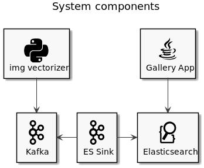

# Image Similarity Search
POC for similarity search by abstract features.  



An image vectorizer (a convolutional neural network which was trained to classify genre/style of paintings) is used to extract different vector representations from approx 75'000 paintings.
The image metadata and extracted vectors are indexed in elasticsearch.  
Clients can search for similar paintings by letting elasticsearch compute vector similarity using either cosine similarity or l2 normalization.

## Setup

1. Download paintings-by-numbers from kaggle
2. Create a volume with the downloaded paintings  
   `docker volume create -d local --opt device=~/art-classification/painter-by-numbers/train --opt o=bind --opt type=none paintings`
3. create a topic for the images:
   ```
   docker exec -it kafka /bin/bash
   kafka-topics --create --zookeeper zookeeper:2181 --replication-factor 1 --partitions 2 --topic paintings
   ```
4. Create the Elastic Connector for the paintings topic
   ```bash
   curl -X POST -H "Content-Type: application/json" -d @paintings.connector.json localhost:8083/connectors
   ```
5. Check the status with `curl http://localhost:8083/connectors/elastic-paintings-connector/tasks/0/status`
6. Create the schema mapping for the Elasticsearch index with
   ```
   curl -X PUT "localhost:9200/paintings?pretty" -H 'Content-Type: application/json' -d @paintings.mapping.json
   ```
7. Run the python script to process all images and submit image representations in kafka  
   The sink connector will ensure that processed records are store din the previously created elasticsearch index
   
8. Run the gallery-backend (`mvn spring-boot:run`)
9. Run the gallery-frontend (`nvm use && npm install && npm start`)
9. Open http://localhost:4200/ to see the result

## References

- https://www.elastic.co/guide/en/elasticsearch/reference/7.5/dense-vector.html
- https://docs.confluent.io/current/connect/kafka-connect-elasticsearch/index.html
- https://keras.io/applications/ 
